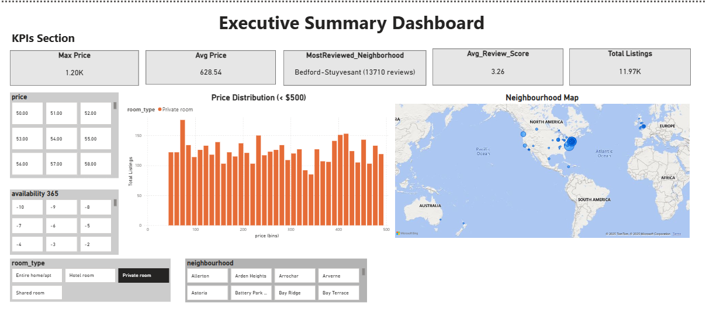

# 🏠 Airbnb Data Analysis Project (End-to-End Pipeline)

## 📌 Project Overview
This project performs **Airbnb Listings Data Analysis** using:
- **SQL (MySQL)** → Data extraction & queries
- **Python (Pandas, Matplotlib, Seaborn)** → Data cleaning, feature engineering & analysis
- **Power BI** → Interactive dashboard for insights & pricing strategy recommendations

The goal is to provide **actionable insights** for pricing strategies, location targeting, and seasonal demand patterns.

## 📂 Airbnb_Data_Analysis
 ├── 📄 Airbnb_Open_Data.csv              # Raw dataset
 ├── 📄 airbnb_analysis.sql               # SQL queries
 ├── 📄 airbnb_analysis.py                # Python analysis script
 ├── 📄 Airbnb_Open_Data.xlsx             # Cleaned dataset
 ├── 📄 airbnb powerBI dashboard.pbix     # Power BI dashboard
 ├── 📂 images                            # Dashboard preview images
 │    ├── powerbi_summary.png
 │    ├── powerbi_trends.png
 │    └── powerbi_profit.png
 └── 📄 README.md                         # Project documentation


---

## 📂 Dataset
**Source:** [Airbnb Open Data – Kaggle](https://www.kaggle.com/datasets/arianazmoudeh/airbnbopendata)  
**File:** `Airbnb_Open_Data.csv`  
**Columns Include:**
- `id`, `name`, `host_id`, `host_name`
- `neighbourhood_group`, `neighbourhood`
- `latitude`, `longitude`
- `room_type`, `price`, `minimum_nights`
- `number_of_reviews`, `last_review`, `reviews_per_month`
- `availability_365`

---

## 🛠 Tools & Technologies
- **SQL**: MySQL for data extraction
- **Python**: Pandas, Matplotlib, Seaborn for EDA
- **Power BI**: Dashboard creation & visualization
- **Excel**: Export of cleaned dataset

---

## 📊 SQL Analysis

```sql
-- Create database---------

CREATE DATABASE Airbnb_Data_Analysis_Project;
USE Airbnb_Data_Analysis_Project;

-- create table -----------

CREATE TABLE airbnb_listings (
    id INT PRIMARY KEY,
    name VARCHAR(255),
    host_id INT,
    host_name VARCHAR(100),
    neighbourhood_group VARCHAR(100),
    neighbourhood VARCHAR(100),
    latitude DECIMAL(10, 8),
    longitude DECIMAL(11, 8),
    room_type VARCHAR(50),
    price DECIMAL(10, 2),
    minimum_nights INT,
    number_of_reviews INT,
    last_review DATE,
    reviews_per_month DECIMAL(5, 2),
    calculated_host_listings_count INT,
    availability_365 INT
);

-- 1. Find Average Price by Location ----- 

SELECT 
    neighbourhood AS location,
    AVG(price) AS avg_price,
    COUNT(*) AS total_listings
FROM 
    airbnb_listings
GROUP BY 
    neighbourhood
ORDER BY 
    avg_price DESC;
    
-- 2. Most Popular Room Types -------- 

SELECT room_type,
COUNT(*) AS Total_listings,
AVG(price) AS average_price
FROM airbnb_listings
GROUP BY room_type
ORDER BY AVG(price) DESC;
    
-- 3. Price Trends by Season -----------
SELECT 
CASE 
   WHEN MONTH BETWEEN 1 AND 2 OR MONTH=12 THEN 'WINTER'
   WHEN MONTH BETWEEN 3 AND 5 THEN 'SPRING'
   WHEN MONTH BETWEEN 6 AND 8 THEN 'SUMMER'
   WHEN MONTH BETWEEN 9 AND 11 THEN 'FALL'
END AS SEASON,
AVG(price) AS averager_price
FROM(
 SELECT 
   EXTRACT(MONTH FROM
	CASE
          WHEN STR_TO_DATE(last_review, '%m/%d/%Y') IS NOT NULL 
           THEN STR_TO_DATE(last_review,'%m/%d/%Y')
        WHEN STR_TO_DATE(last_review, '%d-%m-%Y') IS NOT NULL 
          THEN STR_TO_DATE(last_review,'%d-%m-%Y')
        WHEN STR_TO_DATE(last_review, '%d/%m/%Y') IS NOT NULL 
          THEN STR_TO_DATE(last_review,'%d/%m/%Y')
        WHEN STR_TO_DATE(last_review, '%m-%d-%Y') IS NOT NULL 
          THEN STR_TO_DATE(last_review,'%m-%d-%Y')
        ELSE NULL
	END ) AS month,
       price
FROM airbnb_listings
WHERE last_review IS NOT NULL
) AS subquery
  GROUP BY SEASON
  ORDER BY MIN(month);
```
## 📊 Python Analysis
```python

# ------------------------------------------------------------
# Airbnb Data Analysis Project
# Author: Rithika R
# Description: Load, clean, analyze, and visualize Airbnb listings
# ------------------------------------------------------------

# Import libraries
import pandas as pd
from sqlalchemy import create_engine
import matplotlib.pyplot as plt
import seaborn as sns
from openpyxl import load_workbook

# Load data
df = pd.read_csv(r"C:\Users\rithi\OneDrive\Documents\fielsss\Airbin\Airbnb_Open_Data.csv",low_memory=False)

# Price cleaning (remove $ and commas, convert to float)
df['price']=(df['price'].astype(str).str.replace(r'[\$,]',"",regex=True).replace("",pd.NA).astype(float))

#Handling misssing values
df['price']=df['price'].fillna(df['price'].mean())

#Remove duplicates
df.drop_duplicates(inplace=True)

# Convert last_review to datetime (handle invalid formats)
df['last_reviewdate']=pd.to_datetime(df['last_review'],errors='coerce')

# Fill missing dates with earliest date in dataset (or could use today's date)
df['last_reviewdate']=df['last_reviewdate'].fillna(df['last_reviewdate'].min())

# ------------------------------------------------------------
# Feature Engineering
# ------------------------------------------------------------

# Extract month from last review date
df['month']=df['last_reviewdate'].dt.month
```
## PowerBI Dashboard

### Executive Summary
- KPIs: Total Listings, Avg Price, Highest Price, Review Score
- Map of listings by neighborhood
- Room type distribution
- Top 10 neighborhoods by avg price

!


